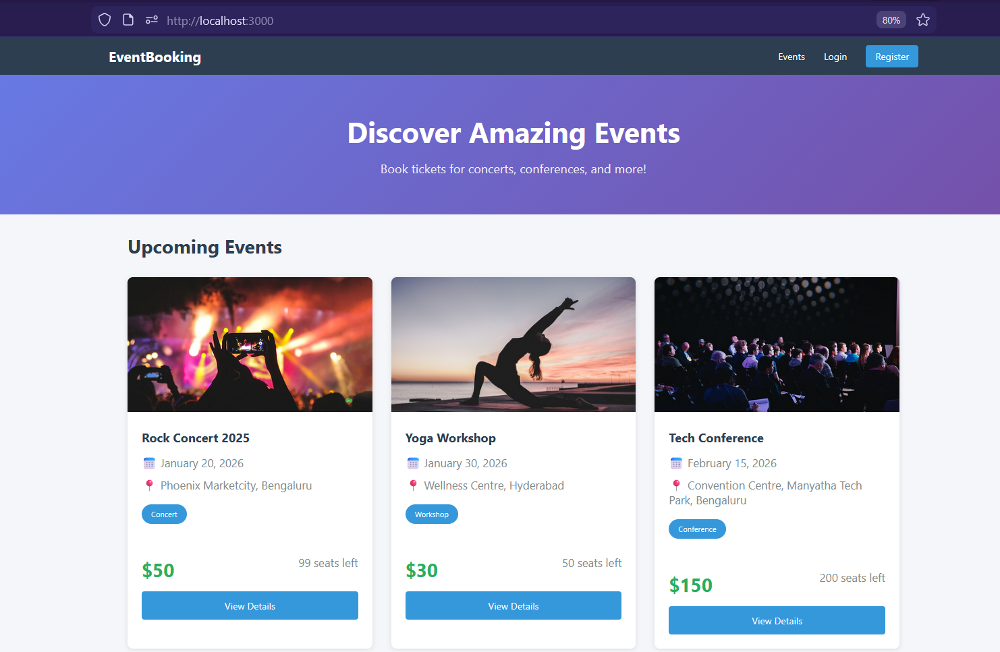
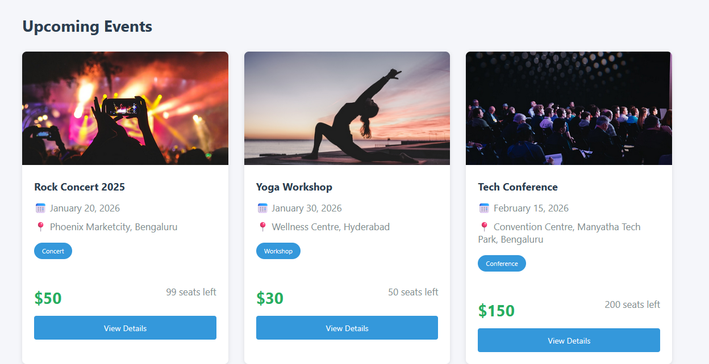
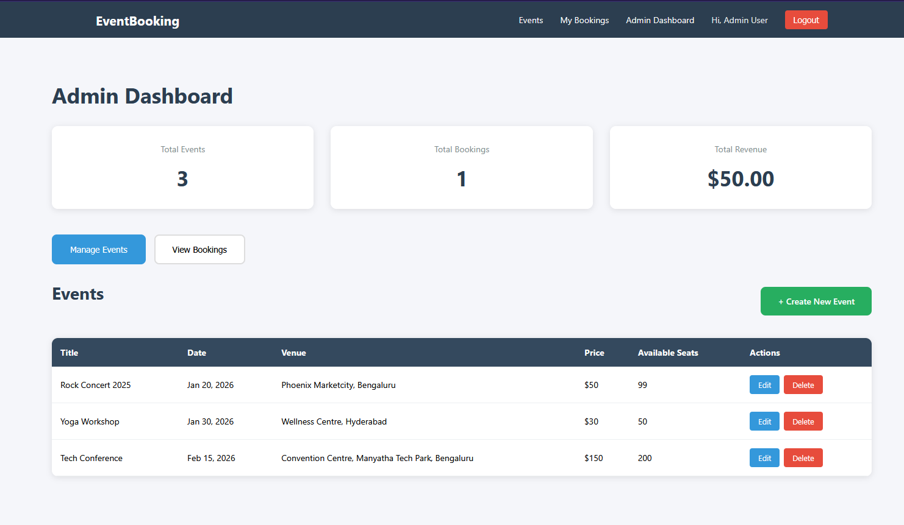
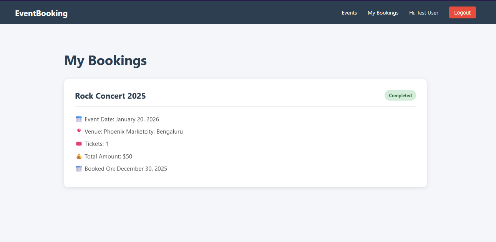

# Event Booking System

A full-stack event booking platform built with the MERN stack (MongoDB, Express.js, React, Node.js) featuring secure authentication, PayPal payment integration, and comprehensive admin controls.

## 🌟 Features
### User Features
- **User Authentication**: Secure registration and login with JWT-based authentication
- **Event Browsing**: View all available events with detailed information
- **Event Details**: Access comprehensive event information including date, venue, pricing, and availability
- **Ticket Booking**: Book multiple tickets for events with real-time seat availability
- **Payment Integration**: Secure payment processing through PayPal
- **Booking History**: View all personal bookings with payment status

### Admin Features
- **Admin Dashboard**: Comprehensive overview with statistics (total events, bookings, revenue)
- **Event Management**: Create, edit, and delete events
- **Booking Management**: View all bookings from all users
- **Availability Control**: Manage event pricing and seat availability
- **Real-time Updates**: Automatic seat count updates after bookings

### Technical Features
- **RESTful API**: Well-structured backend API with proper routing
- **Database Integration**: MongoDB for persistent data storage
- **Secure Password Storage**: Passwords hashed with bcrypt
- **Protected Routes**: Role-based access control (User/Admin)
- **Error Handling**: Comprehensive error handling and validation
- **CORS Enabled**: Cross-origin resource sharing configured
- **Modern UI**: Clean, intuitive interface with smooth animations

## 🚀 Tech Stack

### Frontend
- **React** (v19.2.3) - UI library
- **React Router DOM** (v7.1.1) - Client-side routing
- **Axios** (v1.13.2) - HTTP client
- **PayPal React SDK** (@paypal/react-paypal-js v8.9.2) - Payment integration
- **CSS3** - Styling with modern features (Grid, Flexbox, Animations)

### Backend
- **Node.js** - Runtime environment
- **Express.js** (v4.18.2) - Web framework
- **MongoDB** (v8.0.3) - Database
- **Mongoose** (v8.0.3) - MongoDB ODM
- **JWT** (jsonwebtoken v9.0.2) - Authentication tokens
- **bcryptjs** (v2.4.3) - Password hashing
- **PayPal SDK** (@paypal/checkout-server-sdk) - Payment processing
- **dotenv** (v16.3.1) - Environment variable management
- **CORS** (v2.8.5) - Cross-origin requests

## 📋 Prerequisites

Before running this project, make sure you have the following installed:

- **Node.js** (v16 or higher) - [Download here](https://nodejs.org/)
- **MongoDB** (v5 or higher) - [Download here](https://www.mongodb.com/try/download/community)
  - OR use MongoDB Atlas (cloud database) - [Sign up here](https://www.mongodb.com/cloud/atlas)
- **Git** - [Download here](https://git-scm.com/downloads)
- **PayPal Developer Account** - [Sign up here](https://developer.paypal.com/)

## 🛠️ Installation & Setup

### 1. Clone the Repository
```bash
git clone https://github.com/YOUR_USERNAME/event-booking-system.git
cd event-booking-system
```

### 2. Backend Setup
```bash
cd backend
npm install
```

Create a `.env` file in the `backend` folder:
```env
PORT=5000
MONGO_URI=your_mongodb_connection_string
JWT_SECRET=your_super_secret_jwt_key_here
PAYPAL_CLIENT_ID=your_paypal_client_id
PAYPAL_CLIENT_SECRET=your_paypal_client_secret
PAYPAL_MODE=sandbox
NODE_ENV=development
```

**Getting MongoDB Connection String:**
- **Local MongoDB**: `mongodb://localhost:27017/event-booking`
- **MongoDB Atlas**: 
  1. Go to your cluster → Click "Connect"
  2. Choose "Connect your application"
  3. Copy the connection string
  4. Replace `<password>` with your database user password
  5. Add database name: `/event-booking` before the `?`

**Getting PayPal Credentials:**
1. Go to https://developer.paypal.com/
2. Log in and go to "Apps & Credentials"
3. Under "Sandbox", create a new app
4. Copy the "Client ID" and "Secret"

### 3. Frontend Setup
```bash
cd ../frontend
npm install
```

**Update PayPal Client ID in the code:**
Open `frontend/src/pages/EventDetails.js` and update line 6 with your PayPal Client ID:
```javascript
const PAYPAL_CLIENT_ID = 'your_actual_paypal_client_id_here';
```

### 4. Running the Application

**Terminal 1 - Start Backend:**
```bash
cd backend
npm run dev
```

You should see:
```
Server running on port 5000
MongoDB Connected: ...
```

**Terminal 2 - Start Frontend:**
```bash
cd frontend
npm start
```

The application will open automatically at `http://localhost:3000`

## 👥 Creating Admin Account

After registering a user, you need to manually set their role to "admin" in the database:

### Using MongoDB Compass:
1. Open MongoDB Compass and connect to your database
2. Navigate to `event-booking` → `users` collection
3. Find your user and edit the document
4. Change `"role": "user"` to `"role": "admin"`
5. Save

### Using MongoDB Atlas:
1. Go to your cluster → Click "Browse Collections"
2. Find `event-booking` database → `users` collection
3. Click the edit icon on your user
4. Change `"role": "user"` to `"role": "admin"`
5. Click "Update"

## 📱 Usage Guide

### For Regular Users:

1. **Register/Login**: Create an account or login
2. **Browse Events**: View all available events on the homepage
3. **View Details**: Click "View Details" on any event
4. **Book Tickets**: Select number of tickets and click "Book Now"
5. **Payment**: Complete payment through PayPal sandbox
6. **View Bookings**: Check "My Bookings" to see your booking history

### For Admins:

1. **Access Dashboard**: Click "Admin Dashboard" in navbar
2. **Create Events**: Click "+ Create New Event" button
3. **Manage Events**: Edit or delete existing events
4. **View All Bookings**: Switch to "View Bookings" tab
5. **Monitor Revenue**: Check statistics dashboard

## 🔐 Test Credentials

### PayPal Sandbox Testing:

1. Go to https://developer.paypal.com/
2. Navigate to "Testing Tools" → "Sandbox Accounts"
3. Use the **Personal (Buyer)** account credentials
4. Login with these in the PayPal checkout popup

### Sample Admin Account:
After setup, create and promote a user to admin:
- Email: admin@test.com
- Password: admin123

### Sample User Account:
- Email: user@test.com
- Password: user123

## 📸 Screenshots

### Homepage

*Browse all available events with responsive card layout*

### Event Details & Booking

*Detailed event information with PayPal checkout integration*

### Admin Dashboard

*Comprehensive admin panel with statistics and management tools*

### My Bookings

*User booking history with payment status*


## 🏗️ Project Structure
```
event-booking-system/
├── backend/
│   ├── config/
│   │   ├── db.js                 # MongoDB connection
│   │   └── paypal.js             # PayPal configuration
│   ├── controllers/
│   │   ├── authController.js     # Authentication logic
│   │   ├── bookingController.js  # Booking operations
│   │   └── eventController.js    # Event CRUD operations
│   ├── middleware/
│   │   └── auth.js               # JWT verification & role check
│   ├── models/
│   │   ├── Booking.js            # Booking schema
│   │   ├── Event.js              # Event schema
│   │   └── User.js               # User schema with password hashing
│   ├── routes/
│   │   ├── authRoutes.js         # Auth endpoints
│   │   ├── bookingRoutes.js      # Booking endpoints
│   │   └── eventRoutes.js        # Event endpoints
│   ├── .env                      # Environment variables
│   ├── server.js                 # Express server setup
│   └── package.json              # Backend dependencies
├── frontend/
│   ├── public/
│   ├── src/
│   │   ├── components/
│   │   │   ├── AdminRoute.js     # Protected admin routes
│   │   │   ├── EventCard.js      # Event card component
│   │   │   ├── Navbar.js         # Navigation component
│   │   │   └── PrivateRoute.js   # Protected user routes
│   │   ├── context/
│   │   │   └── AuthContext.js    # Global auth state
│   │   ├── pages/
│   │   │   ├── AdminDashboard.js # Admin control panel
│   │   │   ├── CreateEvent.js    # Event creation form
│   │   │   ├── EventDetails.js   # Event details & booking
│   │   │   ├── Home.js           # Homepage with events
│   │   │   ├── Login.js          # Login page
│   │   │   ├── MyBookings.js     # User bookings
│   │   │   └── Register.js       # Registration page
│   │   ├── utils/
│   │   │   └── api.js            # Axios configuration
│   │   ├── App.js                # Main app component
│   │   └── index.js              # React entry point
│   └── package.json              # Frontend dependencies
└── README.md                     # Project documentation
```

## 🔄 API Endpoints

### Authentication Routes
- `POST /api/auth/register` - Register new user
- `POST /api/auth/login` - User login
- `GET /api/auth/profile` - Get user profile (Protected)

### Event Routes
- `GET /api/events` - Get all events (Public)
- `GET /api/events/:id` - Get single event (Public)
- `POST /api/events` - Create event (Admin only)
- `PUT /api/events/:id` - Update event (Admin only)
- `DELETE /api/events/:id` - Delete event (Admin only)

### Booking Routes
- `POST /api/bookings/create-paypal-order` - Create PayPal order (Protected)
- `POST /api/bookings/capture-paypal-order` - Capture payment (Protected)
- `GET /api/bookings/my-bookings` - Get user bookings (Protected)
- `GET /api/bookings/all` - Get all bookings (Admin only)

## 🌐 Environment Variables

### Backend (.env)
```env
PORT=5000                          # Server port
MONGO_URI=                         # MongoDB connection string
JWT_SECRET=                        # Secret key for JWT
PAYPAL_CLIENT_ID=                  # PayPal client ID
PAYPAL_CLIENT_SECRET=              # PayPal client secret
PAYPAL_MODE=sandbox                # PayPal environment (sandbox/live)
NODE_ENV=development               # Environment mode
```

### Frontend
PayPal Client ID is configured in `src/pages/EventDetails.js`

## ⚠️ Known Limitations & Future Enhancements

### Current Limitations:
- **Event Reminders**: Email/SMS notifications not implemented (future enhancement)
- **Real-time Notifications**: Push notifications not yet integrated
- **File Uploads**: Event images use URLs instead of file uploads
- **Email Verification**: User email verification not implemented

### Planned Features:
- Email notifications for booking confirmations
- SMS reminders for upcoming events
- Email verification on registration
- Image upload for events (using Cloudinary/AWS S3)
- Advanced search and filtering
- Event categories and tags
- User reviews and ratings
- QR code tickets
- Calendar integration
- Social media sharing

## 🐛 Troubleshooting

### MongoDB Connection Issues:
- Ensure MongoDB is running locally or connection string is correct
- Check if IP is whitelisted in MongoDB Atlas (0.0.0.0/0 for development)
- Verify database user credentials

### PayPal Issues:
- Ensure you're using sandbox credentials, not production
- Check if PayPal sandbox account currency matches (USD)
- Verify Client ID and Secret are correct

### Port Already in Use:
```bash
# Kill process on port 5000
npx kill-port 5000

# Kill process on port 3000
npx kill-port 3000
```

### CORS Errors:
- Verify backend CORS is configured to allow `http://localhost:3000`
- Check if both servers are running

## 📝 Version Information

- **Node.js**: v16.20.0 or higher
- **npm**: v8.19.0 or higher
- **MongoDB**: v5.0 or higher
- **React**: v19.2.3
- **Express**: v4.18.2

## 🤝 Contributing

This is a assignment project. Contributions, issues, and feature requests are welcome!

## 📄 License

This project is created for educational purposes as part of a technical assessment.

## 👨‍💻 Author

**Nikhita Moncy**
- GitHub: [Nikhs-04](https://github.com/Nikhs-04)
- Email: nikhitamoncy2004@gmail.com

## 🙏 Acknowledgments

- PayPal for payment gateway integration
- MongoDB for database solutions
- React community for excellent documentation
- All open-source contributors


**Note**: This application uses PayPal sandbox for testing. For production deployment, update PayPal credentials to live mode and ensure all security best practices are followed.
